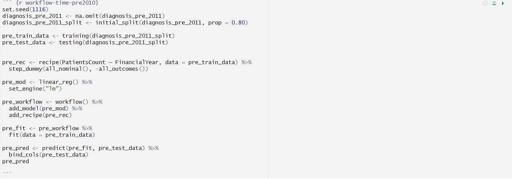
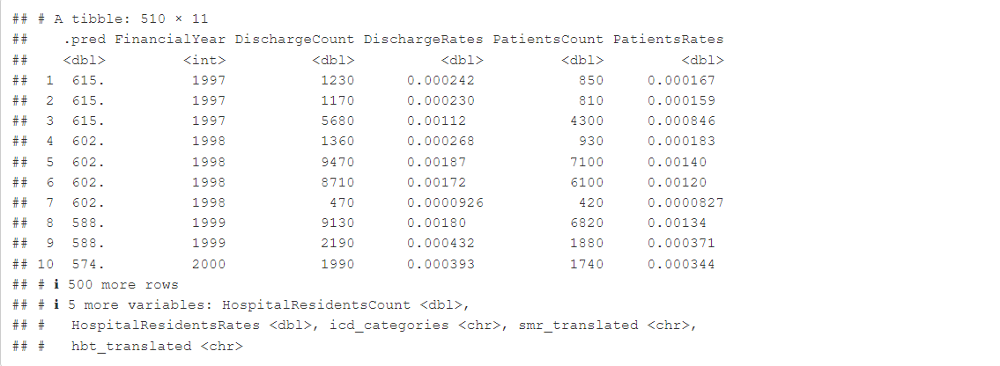
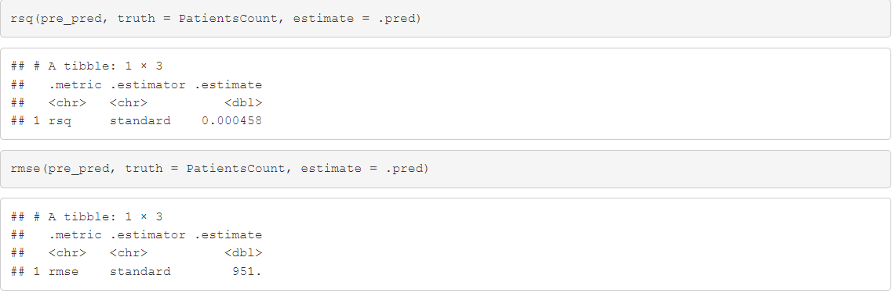
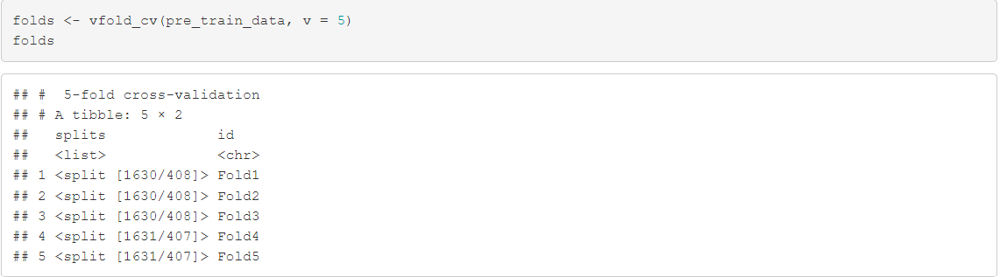
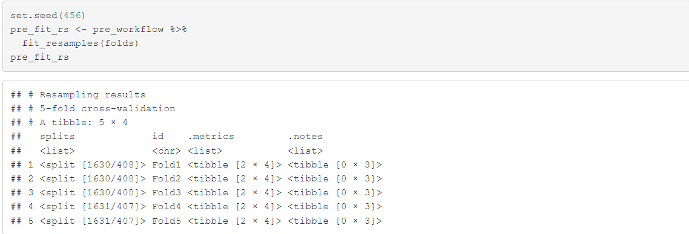
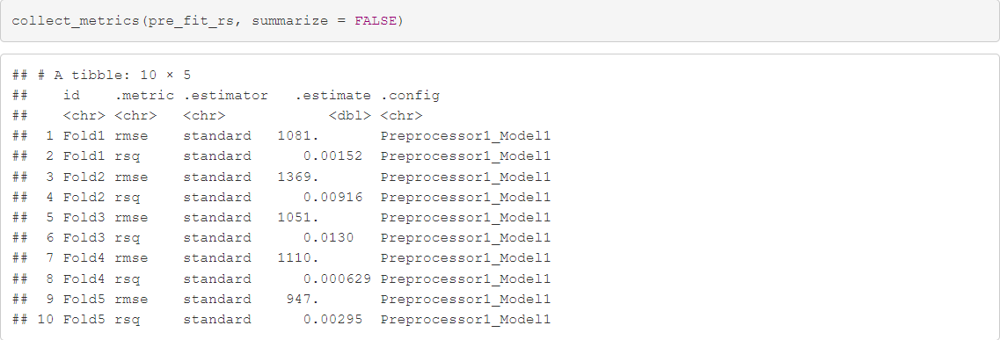

---
title: "Change in Patient Count Over Time with Respect to Different Regions and SIMD"
subtitle: ""
author: "the RegRession Rebels <br> Kenny Chen, Matthew Brown, Jake Leung, Aleksandra Iwaszkiewicz, Sarah De Giuli"
institute: "University of Edinburgh"
date: "`r Sys.Date()`"
output:
  xaringan::moon_reader:
    css: xaringan-themer.css
    lib_dir: libs
    nature:
      ratio: "16:9"
      highlightStyle: github
      highlightLines: true
      countIncrementalSlides: false
        
---

```{r install-package, include = FALSE, eval = FALSE}
# Copy and paste the following code into your console to download and install
# the `xaringan` package that contains all of the code which allows you 
# to create presentation slides in Rmarkdown
install.packages('xaringan')
```


```{r load-packages, include = FALSE}
# Add any additional packages you need to this chunk
library(tidyverse)
library(tidymodels)
library(palmerpenguins)
library(knitr)
library(xaringanthemer)
library(readxl)
library(flextable)
library(kableExtra)
```

```{r setup, include=FALSE}
# For better figure resolution
knitr::opts_chunk$set(fig.retina = 3, dpi = 300, fig.width = 6, fig.asp = 0.618, out.width = "80%")
```

```{r load-data, include=FALSE}
diagnosis <- read_csv("data/mental-health-inpatient-activity-diagnosis-trend.csv", show_col_types = FALSE)

deprivation <- read_csv("data/mental-health-inpatient-activity-deprivation.csv", show_col_types = FALSE)

age_and_sex <- read_csv("data/mental-health-inpatient-activity-age-sex.csv", show_col_types = FALSE)

icd_10_codes <- read_xlsx("data/icd10-lookup.xlsx")

diagnosis_BUT_READABLE <- diagnosis %>% 
  mutate(icd_categories = case_when(
    ICD10Codes == "F00 - F09 or Chapter G and second position F00" ~ "Organic, including symptomatic, mental disorders", 
    ICD10Codes == "F10 - F19" ~ "Mental & behavioural disorders due to psychoactive substance use", 
    ICD10Codes == "F20 - F29" ~ "Schizophrenia, schizotypal, & delusional disorders", 
    ICD10Codes == "F30 - F39" ~ "Mood (affective) disorders", 
    ICD10Codes == "F40 - F49" ~ "Neurotic, stress-related, & somatoform disorders", 
    ICD10Codes == "F60 - F69" ~ "Disorders of adult personality & behaviour", 
    ICD10Codes == "F50 - F59, F70 - F99" ~ "Other selected diagnoses principally affecting children & young people", 
    ICD10Codes == "Non-F codes" ~ "Unrecognized diagnosis", 
                       .default = ICD10Codes )) %>% 
  select(!ICD10Codes)

diagnosis_BUT_READABLE <- diagnosis_BUT_READABLE %>% 
  mutate(smr_translated = case_when(
    Dataset == "SMR00" ~ "Outpatients",
    Dataset == "SMR01" ~ "General/Acute Inpatients/Day Cases (including Geriatric Long Stay Inpatients)",
    Dataset == "SMR02" ~ "Maternity Inpatients/Day Cases",
    Dataset == "SMR04" ~ "Mental Health Inpatients/Day Cases",
              .default = Dataset )) %>% 
  select(!Dataset)

diagnosis_BUT_READABLE <- diagnosis_BUT_READABLE %>% 
  select(
    FinancialYear, HBT, DischargeCount, DischargeRates, PatientsCount,
    PatientsRates,HospitalResidentsCount, HospitalResidentsRates,
    icd_categories, smr_translated) %>%
  mutate(DischargeRates = DischargeRates / 100000, PatientsRates = PatientsRates / 100000)

diagnosis_BUT_READABLE <- diagnosis_BUT_READABLE %>% 
  mutate(hbt_translated = case_when(
    HBT == "S92000003" ~ "Scotland",
    HBT == "S08000015" ~ "Ayrshire and Arran",
    HBT == "S08000016" ~ "Borders",
    HBT == "S08000017" ~ "Dumfries and Galloway",
    HBT == "S08000018" ~ "Fife",
    HBT == "S08000019" ~ "Forth Valley",
    HBT == "S08000020" ~ "Grampian",
    HBT == "S08000021" ~ "Greater Glasgow and Clyde",
    HBT == "S08000022" ~ "Highland",
    HBT == "S08000023" ~ "Lanarkshire",
    HBT == "S08000024" ~ "Lothian",
    HBT == "S08000025" ~ "Orkney",
    HBT == "S08000026" ~ "Shetland",
    HBT == "S08000027" ~ "Tayside",
    HBT == "S08000028" ~ "Western Isles",
    HBT == "S08000029" ~ "Fife",
    HBT == "S08000030" ~ "Tayside",
    HBT == "S08000031" ~ "Greater Glasgow and Clyde",
    HBT == "S08000032" ~ "Lanarkshire",
              .default = HBT)) %>% 
  select(!HBT)

deprivation_BUT_READABLE <- deprivation %>% 
  mutate(smr_translated = case_when(
    Dataset == "SMR00" ~ "Outpatients",
    Dataset == "SMR01" ~ "General/Acute Inpatients/Day Cases (including Geriatric Long Stay Inpatients)",
    Dataset == "SMR02" ~ "Maternity Inpatients/Day Cases",
    Dataset == "SMR03" ~ "Scottish Index of Deprivation",
    Dataset == "SMR04" ~ "Mental Health Inpatients/Day Cases",
              .default = Dataset )) %>% 
  select(!Dataset)

deprivation_BUT_READABLE <- deprivation_BUT_READABLE %>% 
  mutate(hbr_translated = case_when(
    HBR == "S92000003" ~ "Scotland",
    HBR == "S08000015" ~ "Ayrshire and Arran",
    HBR == "S08000016" ~ "Borders",
    HBR == "S08000017" ~ "Dumfries and Galloway",
    HBR == "S08000018" ~ "Fife",
    HBR == "S08000019" ~ "Forth Valley",
    HBR == "S08000020" ~ "Grampian",
    HBR == "S08000021" ~ "Greater Glasgow and Clyde",
    HBR == "S08000022" ~ "Highland",
    HBR == "S08000023" ~ "Lanarkshire",
    HBR == "S08000024" ~ "Lothian",
    HBR == "S08000025" ~ "Orkney",
    HBR == "S08000026" ~ "Shetland",
    HBR == "S08000027" ~ "Tayside",
    HBR == "S08000028" ~ "Western Isles",
    HBR == "S08000029" ~ "Fife",
    HBR == "S08000030" ~ "Tayside",
    HBR == "S08000031" ~ "Greater Glasgow and Clyde",
    HBR == "S08000032" ~ "Lanarkshire",
              .default = HBR )) %>% 
  select(!HBR)

deprivation_BUT_READABLE <- deprivation_BUT_READABLE %>% 
  select(
    FinancialYear, hbr_translated, SIMD, smr_translated, DischargeCount, DischargeRates,
    PatientsCount, PatientsRates,HospitalResidentsCount, HospitalResidentsRates) %>%
  mutate(DischargeRates = DischargeRates / 100000, PatientsRates = PatientsRates / 100000)


age_and_sex_BUT_READABLE <- age_and_sex %>% mutate(hbr_translated = case_when(
HBR == "S92000003" ~ "Scotland",
HBR == "S08000015" ~ "Ayrshire and Arran",
HBR == "S08000016" ~ "Borders",
HBR == "S08000017" ~ "Dumfries and Galloway",
HBR == "S08000018" ~ "Fife",
HBR == "S08000019" ~ "Forth Valley",
HBR == "S08000020" ~ "Grampian",
HBR == "S08000021" ~ "Greater Glasgow and Clyde",
HBR == "S08000022" ~ "Highland",
HBR == "S08000023" ~ "Lanarkshire",
HBR == "S08000024" ~ "Lothian",
HBR == "S08000025" ~ "Orkney",
HBR == "S08000026" ~ "Shetland",
HBR == "S08000027" ~ "Tayside",
HBR == "S08000028" ~ "Western Isles",
HBR == "S08000029" ~ "Fife",
HBR == "S08000030" ~ "Tayside",
HBR == "S08000031" ~ "Greater Glasgow and Clyde",
HBR == "S08000032" ~ "Lanarkshire",
.default = HBR
)) %>% select(!HBR)

age_and_sex_BUT_READABLE <- age_and_sex_BUT_READABLE %>% 
  select(
    FinancialYear, AgeGroup, Sex, hbr_translated, DischargeCount, DischargeRates, PatientsCount,
    PatientsRates)
```

```{r include=FALSE}

#Background image 
style_xaringan(
  title_slide_background_image = "img/confetti.jpg"
)
```
class: center, middle
## Determining whether there exists a correlation between how patient/discharge count has changed over time and the SIMD, index of deprivation, score
---
class:inverse, center, middle
#Dataset
---
```{r dataset1, echo=FALSE}
diagnosis_present <- diagnosis %>%
  select(-HBTQF, -Dataset, -DatasetQF, -DischargeCountQF, -DischargeRatesQF, -PatientCountQF, -PatientRatesQF, -HospitalResidentsCountQF, -HospitalResidentsRatesQF)

kable(diagnosis_present %>% head(n = 15), "html") %>%
  kable_styling(full_width = F, position = "float_left", font_size = 13) #add , font-size = 2 to change the fontsize of the table

#clean the data, remove unnesecary collums like hbt, ive set it so its only the first 15 rows.
```
---
```{r dataset2, echo=FALSE}
deprivation_present <- deprivation %>%
  select(-HBRQF,-Dataset, -DatasetQF, -DischargeCountQF, -DischargeRatesQF, -PatientCountQF, -PatientRatesQF, -HospitalResidentsCountQF, -HospitalResidentsRatesQF)

kable(deprivation_present %>% head(n = 15), "html") %>%
  kable_styling(full_width = F , position = "float_left", font_size = 13)
```
---
class: inverse, center, middle
# Cleaning Datasets
---
# Cleaning Datasets 
```{r cleaning code}
diagnosis_BUT_READABLE <- diagnosis %>% 
  mutate(icd_categories = case_when(
    ICD10Codes == "F00 - F09 or Chapter G and second position F00" ~ "Organic, including symptomatic, mental disorders", 
    ICD10Codes == "F10 - F19" ~ "Mental & behavioural disorders due to psychoactive substance use", 
    ICD10Codes == "F20 - F29" ~ "Schizophrenia, schizotypal, & delusional disorders", 
    ICD10Codes == "F30 - F39" ~ "Mood (affective) disorders", 
    ICD10Codes == "F40 - F49" ~ "Neurotic, stress-related, & somatoform disorders", 
    ICD10Codes == "F60 - F69" ~ "Disorders of adult personality & behaviour", 
    ICD10Codes == "F50 - F59, F70 - F99" ~ "Other selected diagnoses principally affecting children & young people", 
    ICD10Codes == "Non-F codes" ~ "Unrecognized diagnosis", 
                       .default = ICD10Codes )) %>% 
  select(!ICD10Codes)

```
---
```{r more data}
diagnosis_BUT_READABLE <- diagnosis_BUT_READABLE %>% 
  mutate(hbt_translated = case_when(
    HBT == "S92000003" ~ "Scotland",
    HBT == "S08000015" ~ "Ayrshire and Arran",
    HBT == "S08000016" ~ "Borders",
    HBT == "S08000017" ~ "Dumfries and Galloway",
    HBT == "S08000018" ~ "Fife",
    HBT == "S08000019" ~ "Forth Valley",
    HBT == "S08000020" ~ "Grampian",
    HBT == "S08000021" ~ "Greater Glasgow and Clyde",
    HBT == "S08000022" ~ "Highland",
    HBT == "S08000023" ~ "Lanarkshire",
    HBT == "S08000024" ~ "Lothian",
    HBT == "S08000025" ~ "Orkney",
    HBT == "S08000026" ~ "Shetland",
    HBT == "S08000027" ~ "Tayside",
    HBT == "S08000028" ~ "Western Isles",
    HBT == "S08000029" ~ "Fife",
    HBT == "S08000030" ~ "Tayside",
    HBT == "S08000031" ~ "Greater Glasgow and Clyde",
    HBT == "S08000032" ~ "Lanarkshire",
              .default = HBT)) %>% 
  select(!HBT)
```
---
``` {r include = FALSE} 
deprivation_BUT_READABLE <- deprivation %>% 
  mutate(smr_translated = case_when(
    Dataset == "SMR00" ~ "Outpatients",
    Dataset == "SMR01" ~ "General/Acute Inpatients/Day Cases (including Geriatric Long Stay Inpatients)",
    Dataset == "SMR02" ~ "Maternity Inpatients/Day Cases",
    Dataset == "SMR03" ~ "Scottish Index of Deprivation",
    Dataset == "SMR04" ~ "Mental Health Inpatients/Day Cases",
              .default = Dataset )) %>% 
  select(!Dataset)

deprivation_BUT_READABLE <- deprivation_BUT_READABLE %>% 
  mutate(hbr_translated = case_when(
    HBR == "S92000003" ~ "Scotland",
    HBR == "S08000015" ~ "Ayrshire and Arran",
    HBR == "S08000016" ~ "Borders",
    HBR == "S08000017" ~ "Dumfries and Galloway",
    HBR == "S08000018" ~ "Fife",
    HBR == "S08000019" ~ "Forth Valley",
    HBR == "S08000020" ~ "Grampian",
    HBR == "S08000021" ~ "Greater Glasgow and Clyde",
    HBR == "S08000022" ~ "Highland",
    HBR == "S08000023" ~ "Lanarkshire",
    HBR == "S08000024" ~ "Lothian",
    HBR == "S08000025" ~ "Orkney",
    HBR == "S08000026" ~ "Shetland",
    HBR == "S08000027" ~ "Tayside",
    HBR == "S08000028" ~ "Western Isles",
    HBR == "S08000029" ~ "Fife",
    HBR == "S08000030" ~ "Tayside",
    HBR == "S08000031" ~ "Greater Glasgow and Clyde",
    HBR == "S08000032" ~ "Lanarkshire",
              .default = HBR )) %>% 
  select(!HBR)

deprivation_BUT_READABLE <- deprivation_BUT_READABLE %>% 
  select(
    FinancialYear, hbr_translated, SIMD, smr_translated, DischargeCount, DischargeRates,
    PatientsCount, PatientsRates,HospitalResidentsCount, HospitalResidentsRates) %>%
  mutate(DischargeRates = DischargeRates / 100000, PatientsRates = PatientsRates / 100000)


age_and_sex_BUT_READABLE <- age_and_sex %>% mutate(hbr_translated = case_when(
HBR == "S92000003" ~ "Scotland",
HBR == "S08000015" ~ "Ayrshire and Arran",
HBR == "S08000016" ~ "Borders",
HBR == "S08000017" ~ "Dumfries and Galloway",
HBR == "S08000018" ~ "Fife",
HBR == "S08000019" ~ "Forth Valley",
HBR == "S08000020" ~ "Grampian",
HBR == "S08000021" ~ "Greater Glasgow and Clyde",
HBR == "S08000022" ~ "Highland",
HBR == "S08000023" ~ "Lanarkshire",
HBR == "S08000024" ~ "Lothian",
HBR == "S08000025" ~ "Orkney",
HBR == "S08000026" ~ "Shetland",
HBR == "S08000027" ~ "Tayside",
HBR == "S08000028" ~ "Western Isles",
HBR == "S08000029" ~ "Fife",
HBR == "S08000030" ~ "Tayside",
HBR == "S08000031" ~ "Greater Glasgow and Clyde",
HBR == "S08000032" ~ "Lanarkshire",
.default = HBR
)) %>% select(!HBR)

age_and_sex_BUT_READABLE <- age_and_sex_BUT_READABLE %>% 
  select(
    FinancialYear, AgeGroup, Sex, hbr_translated, DischargeCount, DischargeRates, PatientsCount,
    PatientsRates)
```
class: inverse, middle, center
# Initial Visuals
---
```{r visual1, echo=FALSE}
diagnosis_BUT_READABLE %>%
  group_by( FinancialYear) %>%
  summarise(Sum_PatientsCount = sum(PatientsCount, na.rm = TRUE), .groups = "keep") %>%
  
  ggplot(mapping = aes(x = FinancialYear, y = Sum_PatientsCount)) +
  geom_point(color = "blue") +
  labs(title = "Scatter Plot of Total Patients Count Over Time",
       x = "Financial Year",
       y = "Sum of Patients Count") +
  theme(axis.text.x = element_text(angle = 90, vjust = 0.5, hjust = 1)) +
  scale_x_discrete(labels = function(x) str_wrap(x, width = 6))
```
---
```{r visual2, echo=FALSE}
diagnosis_BUT_READABLE %>%
  group_by(FinancialYear) %>%
  summarise(Sum_DischargeCount = sum(DischargeCount, na.rm = TRUE), .groups = "keep") %>%
  
  ggplot(mapping = aes(x = FinancialYear, y = Sum_DischargeCount)) +
  geom_point(color = "blue") +
  labs(title = "Scatter Plot of Total Discharge Count Over Time",
       x = "Financial Year",
       y = "Sum of Discharge numbers") +
  theme(axis.text.x = element_text(angle = 90, vjust = 0.5, hjust = 1)) +
  scale_x_discrete(labels = function(x) str_wrap(x, width = 6))
```
---
```{r visual3, echo=FALSE}
deprivation_BUT_READABLE %>%
  group_by(SIMD) %>%
  summarise(TotalPatientsCount = sum(PatientsCount)) %>%
ggplot(aes(x = as.factor(SIMD), y = TotalPatientsCount)) +
  geom_bar(stat = "identity", fill = "blue") +
  labs(title = "Patients Count vs SIMD",
       x = "SIMD",
       y = "Patients Count") +
  theme_minimal() 
```
---
```{r visual4, echo=FALSE}
deprivation_by_simd <- deprivation_BUT_READABLE %>%
                      group_by(SIMD) %>%
                      summarise(TotalPatientsRates = sum(PatientsRates) / (n()))
deprivation_by_simd %>%
  ggplot(mapping = aes(x = SIMD, y = TotalPatientsRates)) +
    geom_point() +
    geom_smooth(method = "lm", se = FALSE, color = "blue") +  
    labs(title = "Scatterplot with Linear Regression Line: SIMD vs Patients Rates",
         x = "SIMD",
         y = "Patients Rate") +
    theme_minimal()

linear_model <- lm(TotalPatientsRates ~ SIMD, data = deprivation_by_simd)
slope <- coef(linear_model)[2]
print(paste("The slope of the regression line is:", round(slope, 7)))
```
---
class: inverse, middle, center
#Linear Models
---
#Linear Model 1
``` {r linear model1.1}
deprivation_lin_model <- linear_reg() %>% 
  set_engine("lm") %>% 
  fit(PatientsRates ~ SIMD, data = deprivation_BUT_READABLE)
tidy(deprivation_lin_model)
``` 
``` {r linear model1.1 r.squared, echo = FALSE}
r_squared <- glance(deprivation_lin_model)$r.squared
print(paste("R-squared:", round(r_squared, 3)))
```
---
```{r linearmodel1.2, echo=FALSE}
deprivation_simd_lin_model_aug <- augment(deprivation_lin_model$fit)

ggplot(deprivation_simd_lin_model_aug, mapping = aes(x = .fitted, y = .resid)) +
  geom_point(alpha = 0.3) +
  geom_hline(yintercept = 0, color = "gray", lty = "dashed") +
  labs(x = "Predicted Total Patients Rates", y = "Residuals")
```
---
#Quick fix
```{r fixing financial year}
diagnosis_pre_2011 <- diagnosis_BUT_READABLE %>%
  mutate(FinancialYear = strtoi (substring(FinancialYear, 1,4))) %>%
  filter(FinancialYear < 2011, FinancialYear < 2020)
  
  diagnosis_post_2011 <- diagnosis_BUT_READABLE %>%
  mutate(FinancialYear = strtoi (substring(FinancialYear, 1,4))) %>%
  filter(FinancialYear >= 2011 , FinancialYear < 2020)
```
---
#Linear Model 2
```{r linear model 2.1}
diagnosis_pre_2011_lin_model <- linear_reg() %>% 
  set_engine("lm") %>% 
  fit(PatientsCount ~ FinancialYear, data = diagnosis_pre_2011)

diagnosis_pre_2011_lin_model

```
---
```{r linear model 2.2}
diagnosis_post_2011_lin_model <- linear_reg() %>% 
  set_engine("lm") %>% 
  fit(PatientsCount ~ FinancialYear, data = diagnosis_post_2011)

diagnosis_post_2011_lin_model
```
---
```{r linear model 2.3 , echo=FALSE}
diagnosis_pre_2011_lin_model_aug <- augment(diagnosis_pre_2011_lin_model$fit)

ggplot(diagnosis_pre_2011_lin_model_aug, mapping = aes(x = .fitted, y = .resid)) +
  geom_point(alpha = 0.3) +
  geom_hline(yintercept = 0, color = "gray", lty = "dashed") +
  labs(title = "Residuals of Predicted Total Patients Rates pre 2011 exclusive", x = "Predicted Total Patients Rates", y = "Residuals")
glance(diagnosis_pre_2011_lin_model)$r.squared
```
---
```{r linear model 2.4, echo=FALSE}
diagnosis_post_2011_lin_model_aug <- augment(diagnosis_post_2011_lin_model$fit)

ggplot(diagnosis_pre_2011_lin_model_aug, mapping = aes(x = .fitted, y = .resid)) +
  geom_point(alpha = 0.3) +
  geom_hline(yintercept = 0, color = "gray", lty = "dashed") +
  labs(title = "Residuals of Predicted Total Patients Rates post 2011 inclusive", x = "Predicted Total Patients Rates", y = "Residuals")
glance(diagnosis_post_2011_lin_model)$r.squared

```
---
#Change to Cumulative Data
```{r cum}
diagnosis_pre_2011_cum <- diagnosis_pre_2011 %>% group_by(FinancialYear) %>% summarise(TotalPatientsCount = sum(PatientsCount, na.rm = TRUE))

diagnosis_post_2011_cum <- diagnosis_post_2011 %>% group_by(FinancialYear) %>% summarise(TotalPatientsCount = sum(PatientsCount, na.rm = TRUE))
```
---
#Linear Model 3
```{r linear model 3.1}
diagnosis_pre_2011_cum_lin_model <- linear_reg() %>% 
  set_engine("lm") %>% 
  fit(TotalPatientsCount ~ FinancialYear, data = diagnosis_pre_2011_cum)

diagnosis_pre_2011_cum_lin_model
```
---
```{r linear model 3.2}
diagnosis_post_2011_cum_lin_model <- linear_reg() %>% 
  set_engine("lm") %>% 
  fit(TotalPatientsCount ~ FinancialYear, data = diagnosis_post_2011_cum)

diagnosis_post_2011_cum_lin_model
```
---
```{r linear model 3.3, echo=FALSE}
diagnosis_pre_2011_cum_lin_model_aug <- augment(diagnosis_pre_2011_cum_lin_model$fit)

ggplot(diagnosis_pre_2011_lin_model_aug, mapping = aes(x = .fitted, y = .resid)) +
  geom_point(alpha = 0.3) +
  geom_hline(yintercept = 0, color = "gray", lty = "dashed") +
  labs(title = "Residuals of Predicted Total Patients Rates pre 2011 exclusive", x = "Predicted Total Patients Rates", y = "Residuals")
glance(diagnosis_pre_2011_cum_lin_model)$r.squared
```
---
```{r linear model 3.4, echo=FALSE}
diagnosis_post_2011_cum_lin_model_aug <- augment(diagnosis_post_2011_cum_lin_model$fit)

ggplot(diagnosis_pre_2011_lin_model_aug, mapping = aes(x = .fitted, y = .resid)) +
  geom_point(alpha = 0.3) +
  geom_hline(yintercept = 0, color = "gray", lty = "dashed") +
  labs(title = "Residuals of Predicted Total Patients Rates post 2011 inclusive", x = "Predicted Total Patients Rates", y = "Residuals")
glance(diagnosis_post_2011_cum_lin_model)$r.squared
```
---
class: inverse, middle, center
#Workflow
---
```{r work1, echo = FALSE, out.width = "100%", fig.align = "center"}

```
---
```{r work2, echo=FALSE, out.width = "100%", fig.align = "center"}

```
---
```{r work3, echo=FALSE, out.width = "100%", fig.align = "center"}

```
---
```{r work4, echo=FALSE, out.width = "100%", fig.align = "center"}

```
---
```{r work5, echo=FALSE, out.width = "100%", fig.align = "center"}

```
---
```{r work6, echo=FALSE, out.width = "100%", fig.align = "center"}

```
---
#Conclusion 
Our data analysis has shown that patient numbers increase as SIMD decreases, this shows that deprivation has a clear impact on mental health as there is a linear relationship between them. Our research has also shown that from 1997 to 2011 the total number of patients fell consistently. They then remain about the same until 2015. Since then they have started to increase except for a massive sudden drop in 2020. The drop in 2020 is likely an anomaly caused by the COVID-19 pandemic and we would predict that patient numbers would continue to increase over the next years unless action is taken to prevent it. 
